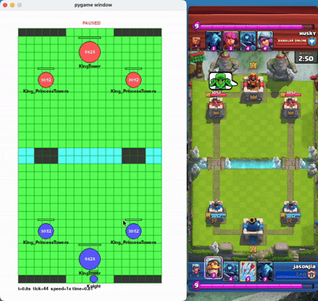

# Clash Royale Simulator

Full project introduction video: https://www.bilibili.com/video/BV1n3uZ6WE5P/

As we all know, to teach an AI how to play a game well, it needs to collect a massive amount of experience. For Clash Royale, experience collection is a huge bottleneck in bot development and training. Even Supercell employees with access to the internal battle engine interface cannot accelerate the engine to collect experience faster (Learning to Play Imperfect-Information Games by Imitating an Oracle Planner, arXiv:2012.12186).

My repository, on the other hand, relies on a self-built complete simulator logic to bridge the experience collection bottleneck currently faced by all AI training. This simulator reads accurate game stats and reproduces the original game engine's A* search pathfinding logic, with card interactions being basically accurate. All thousands of lines of code were written solely by me, with no AI Agent assistance. After continuous optimization, the current simulator can run a full 180-second match in about 1.1 seconds, achieving roughly 150x speedup on my M4 chip. On an average CPU, it can still achieve about 70-90x speedup over real-time.

On top of the simulator, to make it easy for everyone to use my simulator for AI research, I also built a reinforcement learning environment that works out-of-the-box with Stable-Baselines3 for training. It currently uses a CNN-based network architecture, and the model is able to learn and improve steadily.

## Demo



The image above shows a side-by-side comparison of the simulator interface and the actual game. I recorded card deployment timings from real gameplay and fed them into the simulator. In the first 30 seconds of the match, the card interactions are completely accurate.

## Installation

Run the following commands in your terminal:
```bash
git clone https://github.com/Jason-XII/clash-royale-simulator.git
cd clash-royale-simulator
pip install pygame fastcore numpy stable-baselines3 tensorboard --user --no-cache-dir
```

## LAN Multiplayer

This simulator supports LAN multiplayer, meaning you can play against your friends over a local network. I developed this feature only for quickly testing card interactions—it's not a full-fledged Clash Royale server implementation. Steps to set it up:

1. Find your local IP address on the LAN. On Windows, run `ipconfig`; on macOS, run `ifconfig | grep inet` to get your IP address, usually starting with 192.168.
2. Locate the IP address field at the end of `src/clasher_new/server.py` and replace it with your own IP. Then run the server.
3. Run `src/clasher_new/client_side/client.py` on both computers, select your decks, and enter the IP address you just set.
4. Once both clients are connected, the match will start automatically.

## Project Structure

If you're also very interested in training AI models for Clash Royale, I strongly encourage you to dive into the code of this repository. The simulator code totals around 2,000 lines, while the model training code is about 500 lines (rough estimate—I haven't actually counted). For example, want to know how pathfinding works? How the simulator handles target acquisition? What my AI model architecture is, and what the observation space and action space of the RL environment are?

The vast majority of this project's code was written line by line by me. If you want to propose a fix for a bug or add new features to the simulator, please make sure your PR shows no obvious AI traces.

Simulator implementation:

```plaintext
Short and simple logic, defines common classes used by the simulator
arena.py
core.py
player.py
card_utils.py

Core battle engine, pathfinding, and card logic implementation
battle.py
card_mechanics.py
new_visualization.py
pathfinding.py
pathfinding_heap.py

LAN multiplayer
server.py
client_side/client.py
```

RL environment and training code:
```plaintext
environment.py
train.py
```

## Simulator Features

Currently, I have implemented 47 cards. Due to time and energy constraints, I haven't implemented evolutions, elite cards, or champion cards for now. The simulator uses the same pathfinding algorithm as the original game, and most characters have the same stats as in the game.

Here are all the card names I have implemented:

- Knight
- Giant
- Archers
- Goblins
- Pekka
- MiniPekka
- Minions
- Skeletons
- SkeletonArmy
- Balloon
- Witch
- Barbarians
- Golem
- Valkyrie
- Bomber
- Musketeer
- BabyDragon
- Prince
- Wizard
- SpearGoblins
- GiantSkeleton
- HogRider
- MinionHorde
- RoyalGiant
- Princess
- ThreeMusketeers (Not the newest version though)
- BlowdartGoblin (Before nerf)
- AngryBarbarians (English name: Elite Barbarians)
- Bats
- DartBarrell (English name: Flying Machine)
- RoyalHogs
- Cannon
- Xbow
- IceWizard
- SkeletonWarriors
- DarkPrince
- LavaHound
- IceSpirits
- FireSpirits
- Miner
- Sparky
- Bowler
- Rage
- RageBarbarian (English name: Lumberjack)
- BattleRam
- Fireball
- Arrows

## I need help

It's been half a year since I started developing this project, and I've lost count of how many hours I've poured into it. However, this project's ceiling is basically determined by the simulator's ceiling, and I alone can't accurately implement all the logic for all 122 Clash Royale cards. If you're willing to help me implement a card or two, I would be absolutely thrilled.

My Bilibili username is `jasonmoonw`—feel free to send me a private message if you want to reach out. My Discord username is jasoncoder_47308.

Give my project a star!